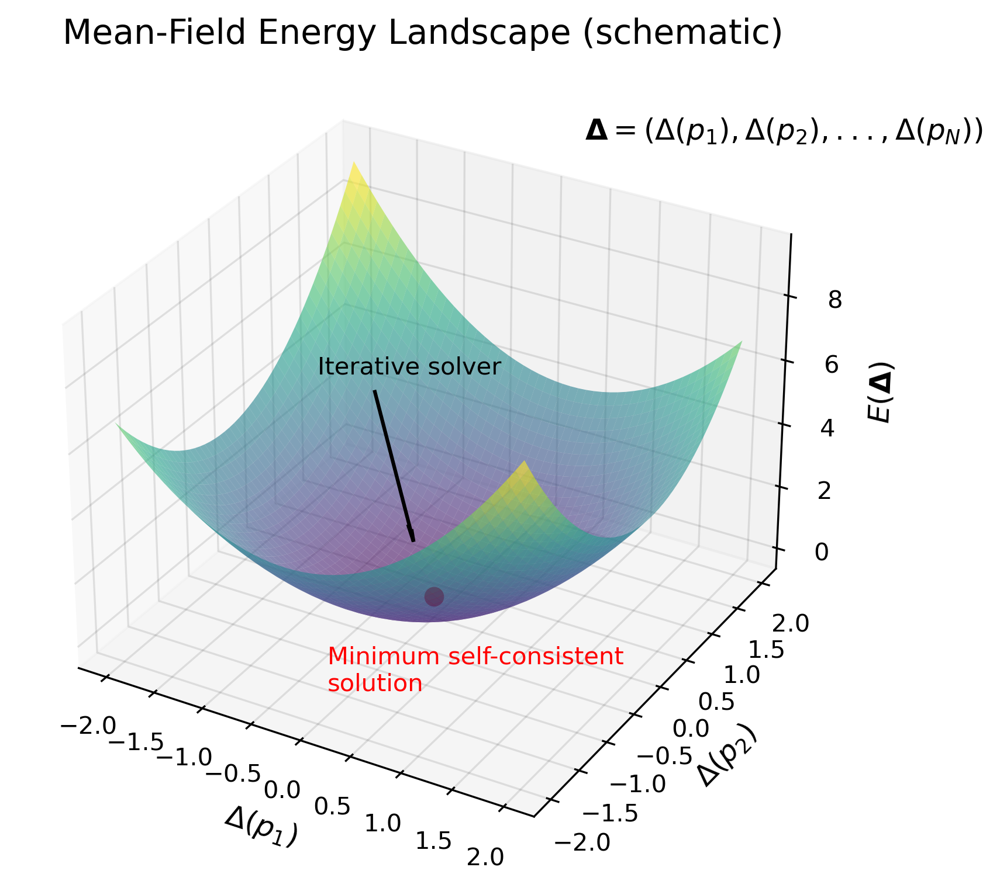
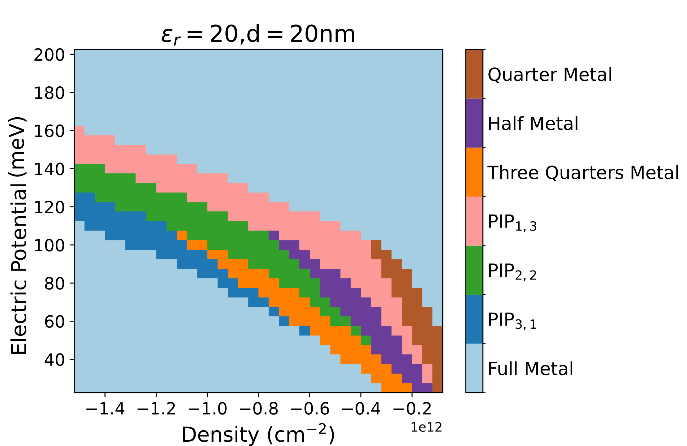

# Ordered States in Bernal Bilayer Graphene

## Introduction
Over the past two decades, two dimensional materials have proven to host a wide variety of novel properties. One of the richest but simplest systems is graphene, a layer of graphite that is only a single atom thick. Stacking these single layers of graphene together has created an entirely new family of materials, including twisted and shifted graphene multilayer systems. These systems in turn have shown a variety of exotic behaviors, such as unconventional superconductivity and new varieties of magnetism. This work analyzes experimental data taken from Bernal bilayer graphene (BBG), two sheets of graphene stacked with a lateral shift. In the experiments, the sample is positioned between two metallic gates so that a perpendicular electric field can be applied to the system. These dual-gates also allow for precise control of how many electrons are in the graphene sample. These two parameters, electric field and electron number, provide a wealth of data as they tuned. One example of data can be found in [Zhou et al., Science 375, 774–778 (2022)](https://www.science.org/doi/10.1126/science.abm8386).

Many features that have been observed in this system are not yet well understood, and I am working to develop models that can successfully explain the experimental data. One of the most interesting features seen in the data involves the statistical properties of electrons. From the simplest models, it is understood that the electrons each have two properties called spin and valley. Both of these properties can take one of two values, for spin it is $\uparrow$ or $\downarrow$, and for valley either $+$ or $-$. Therefore, every electron has one of four labels: $\uparrow+$, $\uparrow-$, $\downarrow+$, or $\downarrow-$. In the simplest models, it is expected that all four labels are equally probable to appear. However, in experimental data, there are regions in parameter space where only electrons with one or two of these labels appear. 

## Effects of Interactions
What is missing from these simplest models that predict equal probability of all labels is the fact that electrons repel each other. To accurately determine the statistics of electrons in Bernal bilayer graphene, effects of interactions must then be included. Individual charges interact via the Coulomb potential:

$$U(\mathbf{x}_1-\mathbf{x}_2) = \frac{e^2}{4\pi \epsilon_0|\mathbf{x}_1-\mathbf{x}_2|}$$

The position of each particle then affects the energies of every other particle, and in a system with roughly $10^6$ particles, exact numerics are intractable. To solve this problem, we adopt Hartree-Fock mean-field approach. That is, we replace the full Coulomb interaction with an average electric field generated by all other charges. Within this computational scheme, the energy of the entire system is

$$E = \sum_{\mathbf{p},\alpha} \left(\varepsilon_{\mathbf{p,\alpha}} - \frac{1}{2} \Delta(\mathbf{p})\right)n_F\left(\varepsilon_{\mathbf{p}}-\Delta_{\alpha}(\mathbf{p})\right),$$
$$\Delta_{\alpha}(\mathbf{p}) = \sum_{\mathbf{k}} V(\mathbf{k}-\mathbf{p})n_F\left(\varepsilon_{\mathbf{k},\alpha}-\Delta_{\alpha}(\mathbf{k})\right)$$

The key quantities in these equations are:
- $\alpha$ - label for the electrons, can be $\uparrow+$, $\uparrow-$, $\downarrow+$, or $\downarrow-$.
- $\varepsilon_{\mathbf{p,\alpha}}$ - the energy of an individual electron with momentum $p$ and label $\alpha$.
- $n_F(\varepsilon_{\mathbf{p}})$ the probability distribution for the charges, gives the average number of electrons at energy $\varepsilon_{\mathbf{p}}$.
- $\Delta_{\alpha}(\mathbf{p})$ - the mean-field (order parameter), representing the momentum-dependent average electric field each electron experiences from its neighbors.
- $V(\mathbf{k}-\mathbf{p})$ - the Fourier-transformed Coulomb interaction, encoding how strongly two electrons, one with momenta k and one with momentum p, repel each other.

The mean-field equations can also be derived by minimizing a free-energy functional with respect to the momentum-dependent order parameter $\Delta(p)$. Numerically, this corresponds to solving for the set of values $\{\Delta(p)\}$ that minimizes the system’s free energy.  A schematic depiction of this process is shown in the figure below. 

## How To Solve The Model
In this repository, I've collected the files that I use to solve these mean field equations in Bernal bilayer graphene under varying electric field and particle number. This amounts to solving for $\Delta_{\alpha} (\mathbf{k})$. As a reminder, this means solving the equation below,

$$\Delta(k) = \sum_{p} V(k-p) n_F(\varepsilon_k - \Delta(p)).$$

The specific form of the interaction we take here is 

$$V(k-p) = \frac{e^2}{2 \epsilon_{r} \epsilon_0|k-p|}\tanh\left(qd\right)$$

This is a modified version of the bare Coulomb interaction that appears when you consider a sample that is sandwiched between two metallic gates. In particular, $d$ is the distance from the sample to the gates, which is set during device fabrication. Of importance also is the quantity $\epsilon_r$, which is called the dielectric constant. The real dielectric constant in the material is not well known, so we tune the value of $\epsilon_r$ from 10 to 20 in order to match experimental results.

To solve the above equation for $\Delta_{\alpha}(\mathbf{p})$, one of the most efficient methods is the iterative approach. In this approach, an initial guess for the $\Delta(k)$ is chosen, call this $\Delta_0(k)$. Then this initial guess is substituted into the right hand side of the equation to obtain $\Delta_1(k)$,

$$\Delta_1(k) = \sum_{p} V(k-p) n_F(\varepsilon_k - \Delta_0(p)),$$

Then $\Delta_1(k)$ can be similarly used to obtain a $\Delta_2(k)$, and this process will continue until convergence is achieved. In this context, convergence has been set to be only obtained when $\max(\Delta_{i+1}(k)-\Delta_{i}(k))<10^{-5}.$

A noteable shortcoming of this method is that it can only find a local minimum which is close to the initial guess. However, thanks to experimental data, approximate solutions for this equation can be constructed, and then used as initial guesses for various different states. In this code, a total of 18 different initial guesses are made, each one corresponding to a different physical state. Of the 18 resulting solutions that are then obtained, the one with the lowest energy is kept. 

This above procedure is applied for many different electric fields and electron numbers. Below I show one of the phase diagrams I generated from the code here,

Each color in the diagram represents a different state, corresponding to the portion of each label that is present. The brown color, for example, is typically called a quarter metal because only one of the four labels are present. In addition, there are also a family of phases called PIP phases, where there are some labels that are present, but only occur with a much smaller probability. The notation used for this is $\text{PIP}_{i,j}$, where $i$ denotes the number of labels which the majority of electrons have, and $j$ is the number of electrons the minority of electrons have.